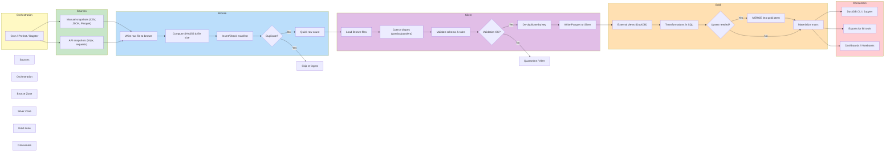

```mermaid
---
id: 7c1731cf-b861-479a-8ee2-2106c0fc1d89
---
flowchart LR

  %% Sources
  subgraph Sources
    direction TB
    S1["Manual snapshots (CSV, JSON, Parquet)"]
    S2["API snapshots (httpx, requests)"]
  end
  S[Sources]

  %% Orchestration
  subgraph Orchestration
    direction TB
    O1["Cron / Prefect / Dagster"]
  end
  O[Orchestration]

  %% Bronze
  subgraph Bronze
    direction TB
    B0["Write raw file to bronze"]
    B1["Compute SHA256 & file size"]
    B2["Insert/Check manifest"]
    D1{"Duplicate?"}
    B3["Quick row count"]
  end
  B[Bronze Zone]

  %% Silver
  subgraph Silver
    direction TB
    V0["Load Bronze files"]
    V1["Coerce dtypes (pandas/pandera)"]
    V2["Validate schema & rules"]
    D2{"Validation OK?"}
    V3["De-duplicate by key"]
    V4["Write Parquet to Silver"]
  end
  V[Silver Zone]

  %% Gold
  subgraph Gold
    direction TB
    G0["External views (DuckDB)"]
    G1["Transformations in SQL"]
    D3{"Upsert needed?"}
    G2["MERGE into gold.latest"]
    G3["Materialize marts"]
  end
  G[Gold Zone]

  %% Consumers
  subgraph Consumers
    direction TB
    C1["DuckDB CLI / Jupyter"]
    C2["Exports for BI tools"]
    C3["Dashboards / Notebooks"]
  end
  C[Consumers]

  %% Flow
  O1 --> S1 --> B0
  O1 --> S2 --> B0
  B0 --> B1 --> B2 --> D1
  D1 -- No --> B3 --> V0
  D1 -- Yes --> SKIP["Skip re-ingest"]

  V0 --> V1 --> V2 --> D2
  D2 -- No --> QFAIL["Quarantine / Alert"]
  D2 -- Yes --> V3 --> V4 --> G0

  G0 --> G1 --> D3
  D3 -- Yes --> G2 --> G3
  D3 -- No --> G3

  G3 --> C1
  G3 --> C2
  G3 --> C3
  style Orchestration fill:#FFF9C4
  style Sources fill:#C8E6C9
  style Bronze fill:#BBDEFB
  style Silver fill:#E1BEE7
  style Gold fill:#FFE0B2
  style Consumers fill:#FFCDD2
```